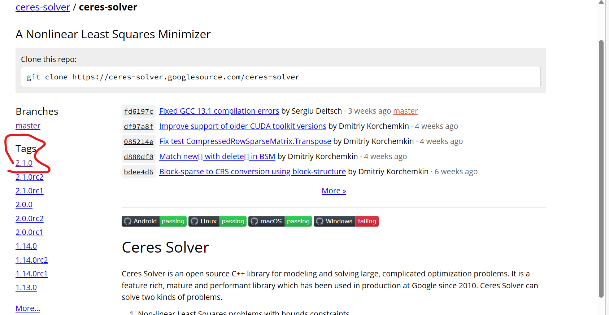
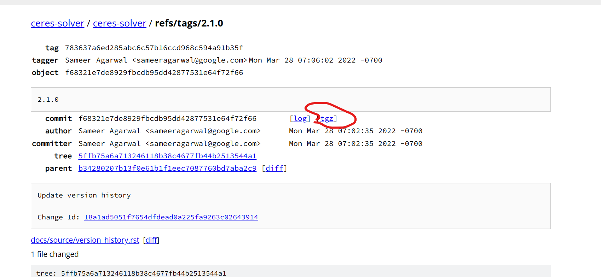

# 1. Environment required
## 1.1. package
## 1.2. tf2_geometry_msgs
## 1.3. gsl
sudo apt-get install libgsl-dev
## 1.4. ceres
```
https://blog.csdn.net/tfb760/article/details/103531029
git clone https://ceres-solver.googlesource.com/ceres-solver
# CMake
sudo apt-get install cmake
# google-glog + gflags
sudo apt-get install libgoogle-glog-dev
# BLAS & LAPACK
sudo apt-get install libatlas-base-dev
# Eigen3


sudo apt-get install libeigen3-dev
# SuiteSparse and CXSparse (optional)
# - If you want to build Ceres as a *static* library (the default)
#   you can use the SuiteSparse package in the main Ubuntu package
#   repository:
sudo apt-get install libsuitesparse-dev
# - However, if you want to build Ceres as a *shared* library, you must
#   add the following PPA:
sudo add-apt-repository ppa:bzindovic/suitesparse-bugfix-1319687
sudo apt-get update
sudo apt-get install libsuitesparse-dev

cd ceres-solver
mkdir build
cd build
cmake ..
make -j4
sudo make install
```
### 1.4.1. git failure: we can download from website



# 2. steps to use it

# 3. mode selection
## 3.1. noise mode selection
### 3.1.1. outlier
ukf_localization/data_gen/pub_node.cpp
```
#define T_DISTR
```
### 3.1.2. ransac
ukf_localization/include/initial_usbl.h
```
#define RANSAC
```
### 3.1.3. robust ukf
ukf_localization/include/ukf.h
```
#define ROBUST_UKF
```
#### 3.1.3.1. ukf_localization/include/ukf.h
      if (prediction_error(i) * prediction_error(i) > P_zz(i, i) * 16)
# 4. algorithm mode
## 4.1. proposed
### 4.1.1. config
#### 4.1.1.1. ukf_localization/config/config_robust_nls_ukf.yaml in ukf_localization/launch/sim_localization.launch
#### 4.1.1.2. ukf_localization/data_gen/config/data_param3.yaml in ukf_localization/launch/sim_localization.launch
## 4.2. steps for doa-only mode
### 4.2.1. code
#### 4.2.1.1. ukf_localization/include/localization_ros.h
```#define ADJUST_NOISE
```
#### 4.2.1.2. ukf_localization/include/localization.h
```//#define BEACON_KNOWN
```
### 4.2.2. config
#### 4.2.2.1. use ukf_localization/config/config_doa.yaml in ukf_localization/launch/sim_localization.launch
#### 4.2.2.2. use ukf_localization/data_gen/config/data_param_doa.yaml in ukf_localization/launch/sim_localization.launch
#### 4.2.2.3. ukf_localization/config/config_doa.yaml
set process noise of beacon localization to 1e-2
set intial covariance of usbl rpy to 1e-20
set intial covariance of beacon position to 100

INITIALIZATION_NLS: False
recvim_noise_sigma: 5.0e+3
#### 4.2.2.4. ukf_localization/data_gen/config/data_param_doa.yaml
recvim_noise_sigma: 5.0e+2

#### 4.2.2.5. ukf_localization/include/ukf.h
      if (prediction_error(i) * prediction_error(i) > P_zz(i, i) * 16)
## 4.3. Dead reckoning
### 4.3.1. config
#### 4.3.1.1. ukf_localization/config/config_dr.yaml vs ukf_localization/config/config_doa.yaml
set process noise of beacon localization to 1e-5
#### 4.3.1.2. ukf_localization/data_gen/config/data_param_dr.yaml versus ukf_localization/data_gen/config/data_param_doa.yaml
USBL: False 
### 4.3.2. code
#### 4.3.2.1. ukf_localization/include/localization_ros.h

```
//#define ADJUST_NOISE
```

## 4.4. DoA-beacon known
### 4.4.1. config
#### 4.4.1.1. ukf_localization/config/config_doa_beacon_known.yaml
beacon_process_noise 1e-20
beacon_initial_noise 1e-20

#### 4.4.1.2. ukf_localization/data_gen/config/data_param_doa.yaml
### 4.4.2. code
#### 4.4.2.1. ukf_localization/include/localization_ros.h
//#define ADJUST_NOISE
#### 4.4.2.2. ukf_localization/include/localization.h
```#define BEACON_KNOWN
```
# 5. steps to run online in real-world experiments
## 5.1. code
### 5.1.1. ukf_localization/include/localization_ros.h:sensor data type
```
#define IMU_MSG AHRS
```
##
### 
## 5.2. 
# 6. some package
## 6.1. ceres
### 6.1.1. num
new ceres::AutoDiffCostFunction<
	          ReprojectionError3D, 2, 4, 3, 3>(
	          	new ReprojectionError3D(observed_x,observed_y))
2:residual
4 param1
3 param2
3 param3
ceres::CostFunction* cost_function = ReprojectionError3D::Create(
                                    sfm_f[i].observation[j].second.x(),
                                    sfm_f[i].observation[j].second.y());

problem.AddResidualBlock(cost_function, NULL, c_rotation[l], c_translation[l], 
                        sfm_f[i].position);	 
### 6.1.2. 2
    	residuals[0] = xp - T(observed_u);
    	residuals[1] = yp - T(observed_v);
### 6.1.3. create input is data

## 6.2. eigen
```
CataCamera::spaceToPlane(const T* const params,
                         const T* const q, const T* const t,
                         const Eigen::Matrix<T, 3, 1>& P,
                         Eigen::Matrix<T, 2, 1>& p)
{
    T P_w[3];
    P_w[0] = T(P(0));
    P_w[1] = T(P(1));
    P_w[2] = T(P(2));

    // Convert quaternion from Eigen convention (x, y, z, w)
    // to Ceres convention (w, x, y, z)
    T q_ceres[4] = {q[3], q[0], q[1], q[2]};

    T P_c[3];
    ceres::QuaternionRotatePoint(q_ceres, P_w, P_c);

    P_c[0] += t[0];
    P_c[1] += t[1];
    P_c[2] += t[2];

    // project 3D object point to the image plane
    T xi = params[0];
    T k1 = params[1];
    T k2 = params[2];
    T p1 = params[3];
    T p2 = params[4];
    T gamma1 = params[5];
    T gamma2 = params[6];
    T alpha = T(0); //cameraParams.alpha();
    T u0 = params[7];
    T v0 = params[8];

    // Transform to model plane
    T len = sqrt(P_c[0] * P_c[0] + P_c[1] * P_c[1] + P_c[2] * P_c[2]);
    P_c[0] /= len;
    P_c[1] /= len;
    P_c[2] /= len;

    T u = P_c[0] / (P_c[2] + xi);
    T v = P_c[1] / (P_c[2] + xi);

    T rho_sqr = u * u + v * v;
    T L = T(1.0) + k1 * rho_sqr + k2 * rho_sqr * rho_sqr;
    T du = T(2.0) * p1 * u * v + p2 * (rho_sqr + T(2.0) * u * u);
    T dv = p1 * (rho_sqr + T(2.0) * v * v) + T(2.0) * p2 * u * v;

    u = L * u + du;
    v = L * v + dv;
    p(0) = gamma1 * (u + alpha * v) + u0;
    p(1) = gamma2 * v + v0;
}
```
# 7. problem
## 7.1. there is some time delay
bag is later than imu time by 0.02s
### 7.1.1. now we have to ignore the delay of usblangles
## 7.2. it need to usbl_enable or not in the localization node rather pub node

# 8. 
# 9. versions
bearing-only-initialization 20220212.zip  1 dimension angle bias

# 10. micellaneous
 
 
  z->measurement(0) = msg->fluid_pressure - targetFrameTrans.getOrigin().z(); is very strange

  isDVLInitialized(false), of no use 


initial state can be adjusted in yaml
        x.setZero();
      P = initialP_;

wrong DVL angle cause diverge for a probability

right angle still diverge

q: 0 0.7 0.7 0; 1 0 0 0 
just for test usbl angle frequency and accuracy

yaml set simulation params shape, magnitude, freq , rotation speed, speed and so on;


q: 0 0.7 0.7 0; 1 0 0 0 
just for test usbl angle frequency and accuracy

seems wrong yaml;
some problems in recvim
wrong theta process covariance
sample for 1s
diverge for angle at first